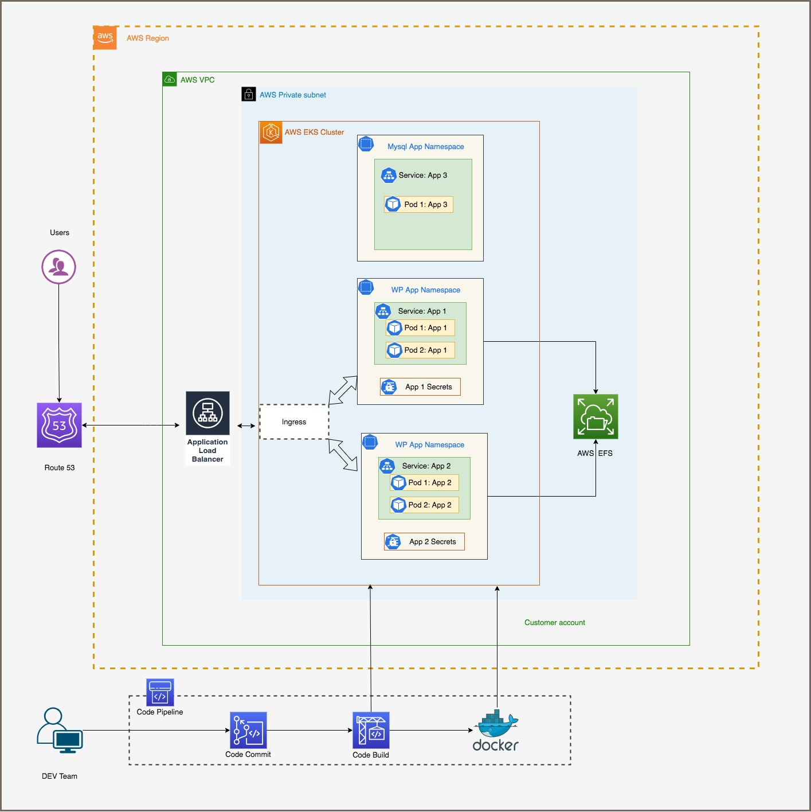

# Getting started with Amazon EKS

## Step - 0

### Environment variables

Let’s start by setting a few environment variables:

```
export AWS_REGION=us-east-1 
export CLUSTER_NAME=eksfgcluster
export AWS_ACCOUNT_ID=$(aws sts get-caller-identity --query 'Account' --output text)
export WOF_ACCOUNT_ID=$(aws sts get-caller-identity --query 'Account' --output text)
export WOF_AWS_REGION=$AWS_REGION
export WOF_EKS_CLUSTER=$CLUSTER_NAME
export STACK_NAME=eksctl-$CLUSTER_NAME-cluster
export ACCOUNT=$(aws sts get-caller-identity --query 'Account' --output text)
```
We have 4 steps to run the application on AWS EKS Fargate with EFS

1. Cluster Creation and Namespace
2. ALB Ingress Controller
3. Persistent storage and mount target in AZ
4. Sample Application deployment (Drupal/Wordpress)

# Solution Architect

 