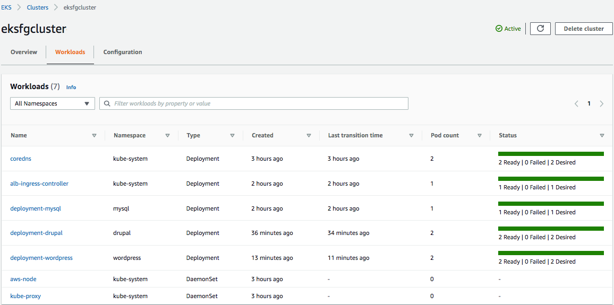
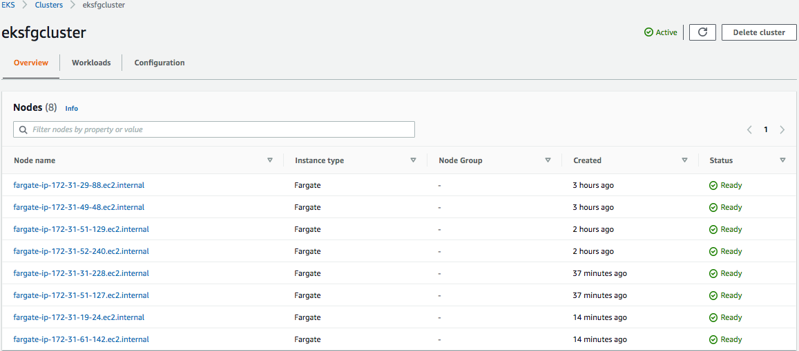
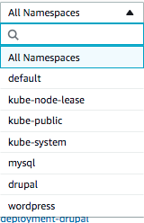

# Cluster Creation and Namespace

## Step - 1

Run below command to create cluster with existing VPC

Note: Please update the cluster name, availability zones and subnets in cluster.yml

To create your cluster with Fargate Linux nodes

1. Create your Amazon EKS cluster with an AWS Fargate profile 

```
eksctl create cluster -f ../01-cluster/cluster.yml
```

Output

You'll see several lines of output as the cluster and Fargate profile are created. Creation takes several minutes. The last line of output is similar to the following example line.

```
[✓]  EKS cluster "eksfgcluster" in "us-east-1" region is ready
```
 
eksctl created a kubectl config file in ~/.kube or added the new cluster's configuration within an existing config file in ~/.kube.

2. Test your configuration.

```
kubectl get svc
```

Output

```
NAME             TYPE        CLUSTER-IP   EXTERNAL-IP   PORT(S)   AGE
svc/kubernetes   ClusterIP   10.100.0.1   <none>        443/TCP   1m
```

```
kubectl get node -A
```

Fargate node output

```
NAME                                                    STATUS   ROLES    AGE     VERSION              INTERNAL-IP       EXTERNAL-IP   OS-IMAGE         KERNEL-VERSION                  CONTAINER-RUNTIME
fargate-ip-192-168-141-147.us-west-2.compute.internal   Ready    <none>   8m3s    v1.18.8-eks-7c9bda   192.168.141.147   <none>        Amazon Linux 2   4.14.209-160.335.amzn2.x86_64   containerd://1.3.2
fargate-ip-192-168-164-53.us-west-2.compute.internal    Ready    <none>   7m30s   v1.18.8-eks-7c9bda   192.168.164.53    <none>        Amazon Linux 2   4.14.209-160.335.amzn2.x86_64   containerd://1.3.2
```
 

## Step - 1.1

Create Namespace in cluster to differentiate the application

``` 
kubectl create namespace drupal
kubectl create namespace wordpress
kubectl create namespace mysql
```

 
