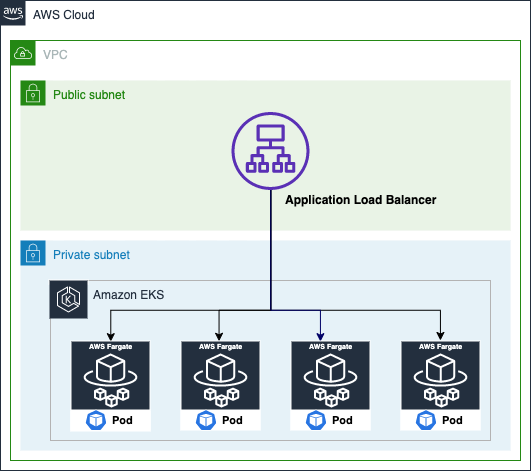

# ALB Ingress Controller

To get started, we’ll create an Amazon EKS cluster and a Fargate profile, implement IAM roles for service accounts on our cluster in order to give fine-grained IAM permissions to our ingress controller pods, deploy a simple application service, and expose it to the internet using an ALB.

 

## Step - 2

Once the cluster creation is completed, you can validate that everything went well by running the following command:

```
kubectl get svc
```
You should get the following response:

```
NAME        TYPE        CLUSTER-IP EXTERNAL-IP  PORT(S) AGE
kubernetes  ClusterIP   10.100.0.1 <none>       443/TCP 16h
```

This response means that the cluster is running and that you are able to communicate with the Kubernetes API.
Set up OIDC provider with the cluster and create the IAM policy used by the ALB Ingress Controller

```
eksctl utils associate-iam-oidc-provider --cluster $CLUSTER_NAME --approve
```

The next step is to create the IAM policy that will be used by the ALB Ingress Controller deployment.

Download the IAM Policy example document.

```
wget -O alb-ingress-iam-policy.json https://raw.githubusercontent.com/kubernetes-sigs/aws-alb-ingress-controller/master/docs/examples/iam-policy.json
```

This policy will be later associated to the Kubernetes service account and will allow the ALB Ingress Controller pods to create and manage the ALB’s resources in your AWS account for you.

File exist in ../02-alb-controller/alb-ingress-iam-policy.json

```
aws iam create-policy --policy-name ALBIngressControllerIAMPolicy --policy-document file://alb-ingress-iam-policy.json
```

### Create a cluster role, role binding, and a Kubernetes service account

Let’s start populating some environment variables that we will be using:

```
STACK_NAME=eksctl-$CLUSTER_NAME-cluster

VPC_ID=$(aws cloudformation describe-stacks --stack-name "$STACK_NAME" | jq -r '[.Stacks[0].Outputs[] | {key: .OutputKey, value: .OutputValue}] | from_entries' | jq -r '.VPC')

AWS_ACCOUNT_ID=$(aws sts get-caller-identity | jq -r '.Account')
```

Now, create the Cluster Role and Role Binding:

```
kubectl apply -f ../02-alb-controller/rbac-role.yaml
```

These commands will create two resources for us and the output should be similar to this:

```
clusterrole.rbac.authorization.k8s.io/alb-ingress-controller created
clusterrolebinding.rbac.authorization.k8s.io/alb-ingress-controller created
```

And finally the Kubernetes Service Account:

```
eksctl create iamserviceaccount \
--name alb-ingress-controller \
--namespace kube-system \
--cluster $CLUSTER_NAME \
--attach-policy-arn arn:aws:iam::$AWS_ACCOUNT_ID:policy/ALBIngressControllerIAMPolicy \
--approve
```

> This eksctl command will deploy a new CloudFormation stack with an IAM role. Wait for it to finish before keep executing the next steps.

### Deploy the ALB Ingress Controller

Update the $CLUSTER_NAME, $VPC_ID and $AWS_REGION in alb-ingress-controller.yaml

```
kubectl apply -f ../02-alb-controller/alb-ingress-controller.yaml
```