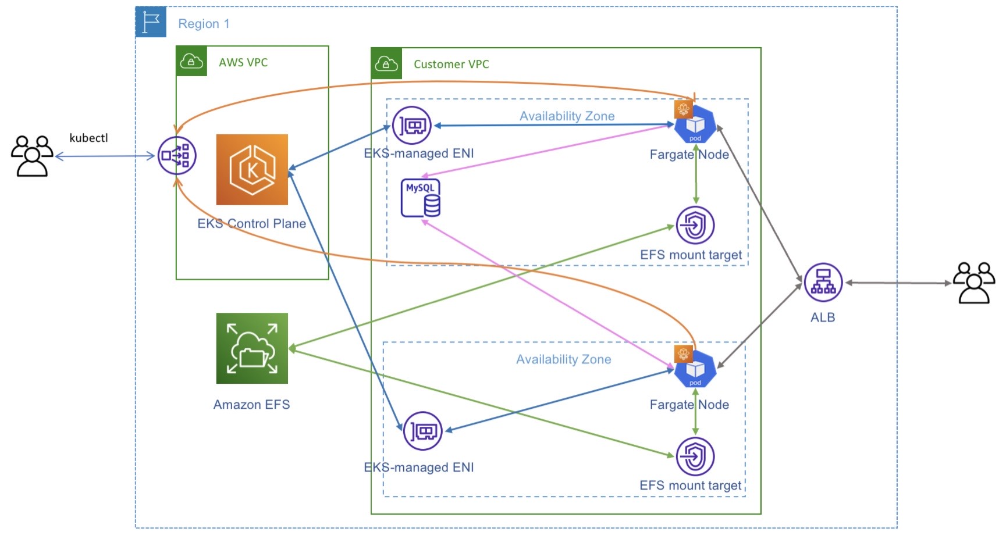
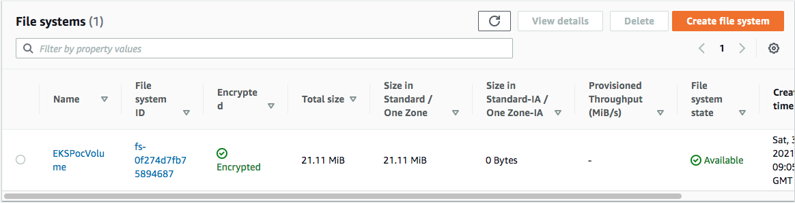
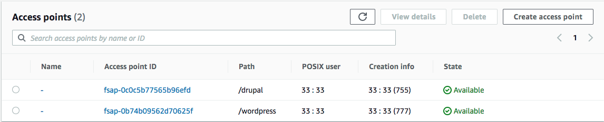

# Persistent storage and mount target in AZ

Amazon EFS provides massively parallel shared access that automatically grows and shrinks as files are added and removed. Multiple containers and EC2 instances can simultaneously perform read and write operations on shared EFS file systems. Having a persistent storage layer for your pods makes Fargate suitable for Kubernetes workloads like data analytics, media processing, content management, web serving, and many others that require functionalities like low latency, high throughput, and read-after-write consistency.

 

## Cluster provisioning

The first step is to create an Amazon EKS cluster using eksctl (Please complete the step-01), When you create a cluster using the eksctl tool and pass the flag –fargate, the eksctl tool will not only create a cluster but also a Fargate profile, which allows the cluster administrator to specify which pods will run on Fargate.

## Step-03

Let’s start by setting a few environment variables:

```
AWS_REGION=us-east-1
WOF_ACCOUNT_ID=$(aws sts get-caller-identity --query 'Account' --output text)
CLUSTER_NAME=eksfgcluster
```

Store the VPC ID and it’s CIDR block into environment variables:

```
WOF_VPC_ID=$(aws eks describe-cluster --name $CLUSTER_NAME --query "cluster.resourcesVpcConfig.vpcId" --region $AWS_REGION --output text)
WOF_CIDR_BLOCK=$(aws ec2 describe-vpcs --vpc-ids $WOF_VPC_ID --query "Vpcs[].CidrBlock" --region $AWS_REGION --output text)
```

## Create an EFS filesystem

We need to create an EFS filesystem before we can create a persistent volume.

### Create an EFS file system:

```
WOF_EFS_FS_ID=$(aws efs create-file-system \
  --creation-token eks-on-fargate \
  --encrypted \
  --performance-mode generalPurpose \
  --throughput-mode bursting \
  --tags Key=Name,Value=EKSPocVolume \
  --region $AWS_REGION \
  --output text \
  --query "FileSystemId")
```

 


### Create an EFS access point:

```
WOF_EFS_AP=$(aws efs create-access-point \
  --file-system-id $WOF_EFS_FS_ID \
  --posix-user Uid=33,Gid=33 \
  --root-directory "Path=/drupal,CreationInfo={OwnerUid=33,OwnerGid=33,Permissions=755}" \
  --region $AWS_REGION \
  --query 'AccessPointId' \
  --output text)
```

 


Note: If need more access point, excute the above step with updating the root-directory Path and it will create new access point in same file system

Amazon EFS Access Points for the Drupal/Wordpress application, with a user identity mapped to user id “33;” these EFS Access Points will be mounted with encryption in transit on the Fargate task. 

The Drupal/Wordpress application saves the files system, images in the /var/www/html/web/sites/default/files, /var/www/html/web/wp-content/uploads, directories, respectively. The application accesses the files as “www-data” user, with the user-id as “33.”

Next we need a security group for the file system that allows inbound NFS traffic (port 2049):

```
WOF_EFS_SG_ID=$(aws ec2 create-security-group \
  --description eks-on-fargate \
  --group-name eks-on-fargate \
  --vpc-id $WOF_VPC_ID \
  --region $AWS_REGION \
  --query 'GroupId' --output text)

aws ec2 authorize-security-group-ingress \
  --group-id $WOF_EFS_SG_ID \
  --protocol tcp \
  --port 2049 \
  --cidr $WOF_CIDR_BLOCK
```

Create EFS mount targets for the volume in all subnets used in the Fargate profile that eksctl created:

```
for subnet in $(aws eks describe-fargate-profile \
  --output text --cluster-name $CLUSTER_NAME\
  --fargate-profile-name fp-drupal  \
  --region $AWS_REGION  \
  --query "fargateProfile.subnets"); \
do (aws efs create-mount-target \
  --file-system-id $WOF_EFS_FS_ID \
  --subnet-id $subnet \
  --security-group $WOF_EFS_SG_ID \
  --region $AWS_REGION); \
done 
```

In the EKS cluster that the command above creates, EKS schedules pods on Fargate across multiple AZs. Fargate pods in each AZ will mount the EFS file system using an EFS mount target in that AZ.

## Create a persistent volume

Create a persistent volume and a persistent volume claim using your EFS file system:

Update the $WOF_EFS_FS_ID and $WOF_EFS_AP in persistent_volume_claim-drupal.yaml and persistent_volume_claim-wordpress.yml

```
kubectl apply -f persistent_volume_claim.yml
kubectl apply -f persistent_volume_claim-drupal.yml
kubectl apply -f persistent_volume_claim-wordpress.yml
```